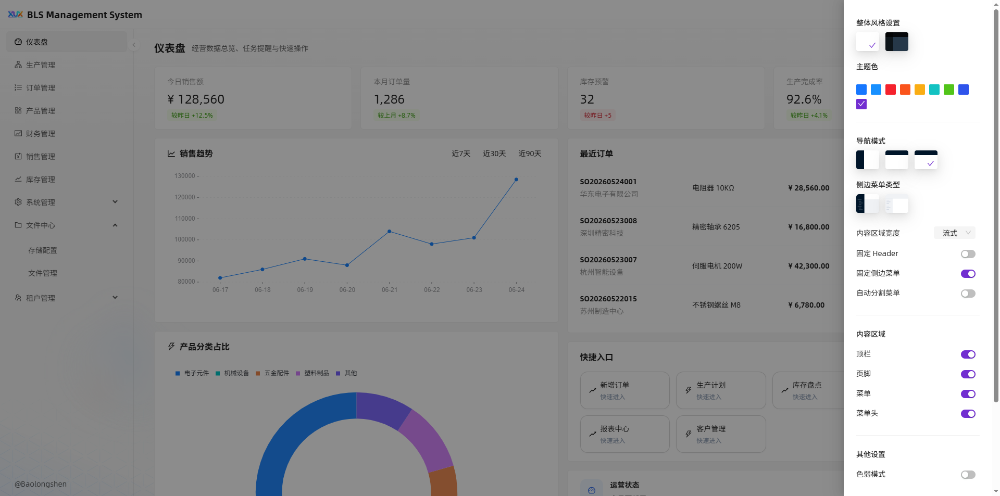
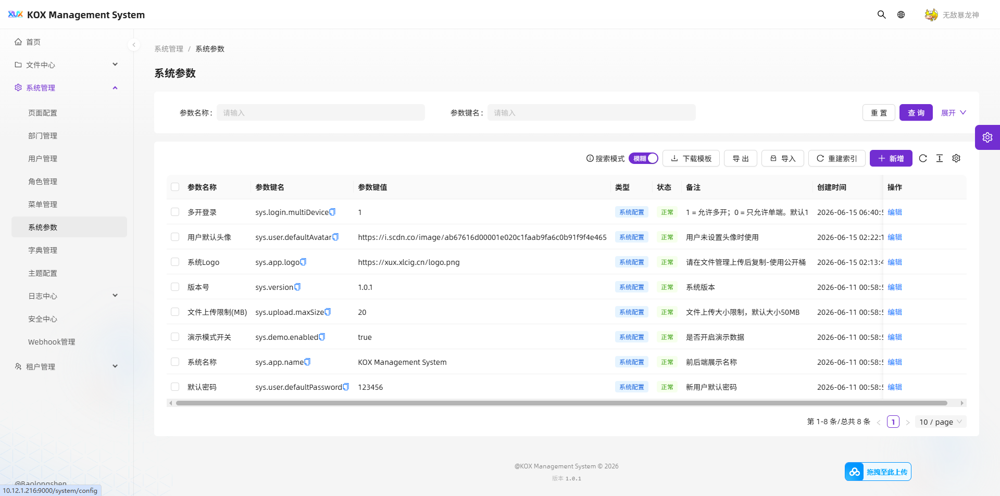

# BLS-KOX

[](https://github.com/npcxl/BLS-KOX/actions/workflows/ci.yml)
[](LICENSE)
[](https://www.typescriptlang.org/)
[](https://koajs.com/)
[](https://spring.io/)
[](https://openjdk.org/)
[](https://pro.ant.design/)
[](https://react.dev/)
[](CHANGELOG.md)

> 双后端并存的开源多租户后台开发框架与管理系统模板。
> **一套前端、一套 MySQL、一套 Redis**，同时支持 Koa (TypeScript) 和 Spring Boot (Java 21) 两套后端。
> 内置 RBAC、多租户隔离、JWT 会话体系、防重放、限流、安全审计、WebSocket、Prometheus Metrics、**AI 智能助手**。

## ✨ Why BLS-KOX

- **双后端并存** — Koa (TypeScript) 与 Spring Boot (Java 21) 两套后端，API 完全兼容，按需选择或共存
- **AI 智能助手** — 内置 AI 微服务，自然语言一键生成 CRUD 模块、SQL 查询、安全审计、配置审查
- **安全内置，而非事后追加** — 防重放、限流、审计日志随框架自带
- **多租户原生支持** — tenant_id 自动注入，跨租户访问自动告警
- **一行配置生成接口** — Koa `defineCrudModule()` 生成完整的 list/add/edit/remove/status
- **现代化全栈** — React 19 + Ant Design Pro 6 + TypeScript 前端，双后端任意切换
- **共享基础设施** — 同一套 MySQL 8.0 + Redis 7 + `sql/Init.sql`，两套后端共用
- **Docker 一键部署** — `docker compose up -d`

**适合**：学习后端架构 · 快速搭建管理后台 · SaaS 原型开发 · 权限系统参考 · 多语言后端对比 · 二次开发

## 📸 预览





## 🏗 Architecture

```
┌──────────────────────────────────────────────────────────────────┐
│                     bls-admin (React 19)                         │
│            Ant Design Pro 6 · Umi 4 · TypeScript                 │
└───────────────────────────┬──────────────────────────────────────┘
                            │ HTTP/WS
                            ▼
┌──────────────────────────────────────────────────────────────────┐
│                       Nginx (反向代理)                            │
│              static files · /api proxy · gzip                    │
└───────────────────────────┬──────────────────────────────────────┘
                            │
       ┌────────────────────┼────────────────────┐
       ▼                    ▼                    ▼
┌──────────────┐  ┌──────────────────┐  ┌──────────────┐
│  bls-server  │  │ bls-ai-service   │  │bls-java-server│
│  Koa 3       │  │ Koa · AI 微服务   │  │ Spring Boot 3 │
│  默认后端     │  │ :7201            │  │ Java 21       │
│  :7001       │  │                  │  │ :8080 (可选)   │
│              │  │ ┌──────────────┐  │  │               │
│ ┌──────────┐ │  │ │ CRUD 生成器   │  │  │ ┌───────────┐ │
│ │CRUD工厂  │ │  │ │ SQL 助手      │  │  │ │Security   │ │
│ │Middleware│ │  │ │ 审计分析器    │  │  │ │Chain      │ │
│ └──────────┘ │  │ │ 配置审查器    │  │  │ └───────────┘ │
│              │  │ │ KOX-AI 对话   │  │  │               │
└──────┬───────┘  │ └──────────────┘  │  └───────┬───────┘
       │          └────────┬─────────┘          │
       └───────────┬───────┴────────────────────┘
                   │
    ┌──────────────┼──────────────┐
    ▼              ▼              ▼
┌────────┐  ┌──────────────┐  ┌──────────────────┐
│ MySQL  │  │    Redis 7   │  │   Prometheus     │
│  8.0   │  │ Session/Limit│  │   /api/metrics   │
└────────┘  └──────────────┘  └──────────────────┘
```

> **关键设计**：两套后端共用同一套 MySQL 数据库（`sql/Init.sql`）、同一套 Redis、同一套前端代码。Nginx 通过 upstream 切换后端，前端无需任何修改。AI 微服务独立部署，通过 `/api/ai/*` 路由提供智能能力。

## 🛡️ Security

| 能力 | 实现 |
|------|------|
| 安全中心 Dashboard | 登录失败趋势、高频 IP、风险账号、防重放/限流拦截统计 |
| 防重放攻击 | Timestamp + Nonce + HMAC 签名验证 |
| 频率限制 | IP + 账号多维度 Redis Lua 滑动窗口 |
| IP 黑名单 | Redis 即时生效 + DB 持久化，事件中心自动封禁 |
| 风险规则引擎 | 6 条规则：爆破检测、Token 复用、跨租户访问、签名无效、重放攻击、高频限流 |
| 会话中心 | Session Index 管理、Refresh Token Rotation、复用检测 |
| 文件安全 | 扩展名/MIME/Magic Number 多层校验、路径穿越防护、敏感字段脱敏 |
| 数据权限 | ALL / TENANT / DEPT / DEPT_AND_CHILDREN / SELF / CUSTOM 六级范围 |
| 安全审计 | 24 种事件类型、4 级风险等级、全链路日志 |

## 🚀 Features

| 模块 | 说明 |
|------|------|
| **AI 智能助手** | 自然语言一键生成 CRUD 模块、SQL 查询、安全审计、配置审查 |
| 多租户隔离 | 自动 tenant_id 注入，跨租户访问告警，Ownership Guard |
| RBAC 权限 | 角色 → 菜单 → 按钮三级权限 |
| JWT 会话体系 | Access/Refresh Token，Rotation，Reuse Detection，Session Center |
| 泛型 CRUD 工厂 | `defineCrudModule()` 一行生成完整 CRUD 接口 |
| 动态列配置 | 运行时配置列可见/可搜/可编辑，无需改代码 |
| 防重放攻击 | Timestamp + Nonce + HMAC + 幂等 Key |
| 频率限制 | IP + 账号多维度 Redis 滑动窗口限流 |
| 安全审计 | 登录/权限/重放/签名全链路日志 |
| 全局搜索 | Ctrl+K 跨模块模糊搜索 |
| Excel 导入导出 | 模板下载、批量导入、去重更新、失败明细 |
| WebSocket | 看板数据实时推送 |
| Prometheus Metrics | `/api/metrics`，HTTP/Security/DB/Redis/WS 全量指标 |
| Docker 部署 | `docker compose up -d` 一键启动 |

## 🔀 双后端定位

BLS-KOX 提供两套后端，**各有特点，按需选择**：

| | Koa (TypeScript) | Java (Spring Boot) |
|------|-------------------|---------------------|
| **定位** | 轻量灵活，快速二开 | 工程化稳定，企业级 |
| **亮点** | `defineCrudModule()` 一行配置生成 CRUD | 注解式 AOP + Spring 生态 |
| **适合** | Node.js 全栈、快速原型 | Java 团队、企业项目、微服务演进 |

两套后端共享同一套前端、MySQL、Redis、`sql/Init.sql`、API 规范。切换后端只需改代理地址。

> 详见 [双后端定位对比](./docs/backend-comparison.md)

## 🛠 Tech Stack

| 层 | 技术 |
|----|------|
| 前端 | React 19 + Ant Design Pro 6 + Umi 4 + TypeScript |
| 后端 (Koa) | Koa 3 + TypeScript 6 + Kysely ORM + Zod（默认，主后端）|
| 后端 (Java) | Spring Boot 3.3 + Java 21 + MyBatis-Plus 3.5 + Spring Security（可选，API 兼容并存）|
| 数据库 | MySQL 8.0（两套后端共用同一库同一表结构）|
| 缓存 | Redis 7（两套后端共用 Session / 限流 / 缓存）|
| 部署 | Docker Compose + Nginx |
| 文档 | Knife4j (Java) / Swagger (Koa)

### 📡 API 文档

接口文档自动生成，支持在线调试：

```bash
# 生成 openapi.json + 启动 Swagger UI 预览
cd bls-server && npm run openapi:serve

# 仅生成 openapi.json（供 /api/docs 使用）
npm run openapi
```

启动服务后访问：
- **Swagger UI**：http://localhost:6001/api/docs
- **OpenAPI JSON**：http://localhost:6001/api/openapi.json

## 🔧 环境要求

| 依赖 | 最低版本 | 说明 |
|------|----------|------|
| Node.js | ≥ 22.0.0 | Koa 运行时 |
| Java | ≥ 21 | Java 后端运行时（可选） |
| Maven | ≥ 3.8 | Java 后端构建（可选） |
| MySQL | 8.0 | 数据库 |
| Redis | 7.0 | 缓存 / 限流 / Session |
| Docker | 20.10+ | 可选，一键部署使用 |

## 🏃 Quick Start

### 方式一：Docker 本地部署（推荐，零配置）

```bash
# 克隆项目
git clone https://github.com/npcxl/BLS-KOX.git && cd BLS-KOX

# 一键启动（使用 .env.docker 配置文件）
docker compose --env-file .env.docker down -v --remove-orphans
docker compose --env-file .env.docker up -d --build

# 查看状态（全部 healthy 即为成功）
docker compose ps
```

启动成功后访问：

| 服务 | 地址 | 说明 |
|------|------|------|
| 管理端 | http://localhost | 前端 SPA |
| API | http://localhost/api | 后端接口 |
| 健康检查 | http://localhost/api/health | 服务状态 |
| MinIO 控制台 | http://localhost:9001 | 对象存储管理 |
| 接口文档 | http://localhost:6001/api/docs | **仅本地开发可用，见下方说明** |

> **注意**：Docker 部署时 Swagger 接口文档（`/api/docs`）不对外暴露。需要查看接口文档请使用本地开发模式，或运行 `cd bls-server && npm run openapi:serve` 在本地启动文档服务。

### 方式二：本地开发（可查看接口文档）

```bash
# 1. 启动基础设施（MySQL + Redis + MinIO）
docker compose --env-file .env.docker up -d mysql redis minio

# 2. 初始化数据库
docker exec bls-mysql mysql -uroot -p"${DB_PASSWORD}" kox < sql/Init.sql

# 3. 后端（Koa）
cd bls-server
cp .env .env.docker  # 或手动配置 .env，DB_HOST=localhost
npm install
npm run dev                                    # http://localhost:6001

# 4. 前端（新终端）
cd ../bls-admin
npm install
npm run dev                                    # http://localhost:9000
```

本地开发启动后访问接口文档：
- **Swagger UI**：http://localhost:6001/api/docs
- **OpenAPI JSON**：http://localhost:6001/api/openapi.json

### 方式三：纯本地运行（不使用 Docker）

确保本地已安装 MySQL 8.0 + Redis 7.0，然后：

```bash
# 1. 导入数据库
mysql -uroot -p < sql/Init.sql

# 2. 配置环境变量
cd bls-server
cp .env.example .env
# 编辑 .env：DB_HOST=127.0.0.1 REDIS_HOST=127.0.0.1

# 3. 启动后端
npm install && npm run dev                     # http://localhost:6001

# 4. 启动前端
cd ../bls-admin
npm install && npm run dev                     # http://localhost:9000
```

### 方式三：Java 后端（与 Koa 并存）

```bash
# 1. 编译 Java 项目
cd bls-java-server
mvn clean package -DskipTests

# 2. Docker 部署 Java 后端
cd ..
docker compose --env-file .env.docker down
docker compose --env-file .env.docker -f docker-compose.yml -f docker-compose.java.yml up -d --build

# 3. 切回 Koa
docker compose --env-file .env.docker down
docker compose --env-file .env.docker up -d --build
```

> 详见 [Docker 部署指南](./docs/docker-deploy.md)。

### 切换后端（Koa ↔ Java）

**方式一：Nginx upstream 切换**

修改 `nginx.conf` 中的 upstream 配置：
```nginx
# 使用 Koa（默认）
upstream bls_server {
    server bls-server:7001;
}

# 切换到 Java
# upstream bls_server {
#     server bls-java-server:8080;
# }
```

**方式二：前端直接代理**

修改前端开发代理或环境变量，将 API 地址指向 Java 后端端口（默认 8080）。

> **注意**：Java 后端与 Koa 后端 API 完全兼容，前端代码无需任何修改。

## 🔑 默认账号

| 项目 | 值 |
|------|-----|
| 默认租户 | `000000` |
| 默认账号 | `superadmin` |
| 默认密码 | `123456` |
| 租户管理员 | `admin / 123456`（租户 `100000`） |

> ⚠️ **该账号仅适用于本地演示。生产部署前必须立即修改密码！** 详见 [SECURITY.md](./SECURITY.md)。

### 一键运行成功标志

Docker 部署成功后，执行 `docker compose ps` 应看到全部服务均为 `Up` (healthy)：

```
NAME           STATUS
bls-admin      Up
bls-minio      Up (healthy)
bls-mysql      Up (healthy)
bls-nginx      Up
bls-redis      Up (healthy)
bls-server     Up (healthy)
```

## 📁 Project Structure

```
BLS-KOX/
├── bls-server/              # Koa + TypeScript 后端（默认主后端）
│   ├── src/
│   │   ├── api/             # 业务接口（自动扫描注册）
│   │   │   ├── ai/          # AI 对话存储接口
│   │   │   ├── auth/        # 登录/登出/刷新/用户信息
│   │   │   ├── system/      # 用户/角色/菜单/部门/字典/配置等
│   │   │   └── common/      # Excel 导入导出
│   │   ├── core/            # CRUD 工厂 defineCrudModule()、数据库、审计、日志
│   │   ├── middleware/      # JWT 认证/权限/租户/HTTP Metrics
│   │   ├── middlewares/     # 防重放中间件
│   │   ├── security/        # Ownership Guard、Session Center、限流、事件中心
│   │   ├── shared/          # JWT、Redis、Snowflake、工具函数
│   │   ├── observability/   # Prometheus 指标
│   │   ├── queue/           # Job Worker（轮询 sys_jobs）
│   │   └── outbox/          # Outbox Pattern 事务事件发布
│   └── sql/                 # 数据库迁移
├── bls-ai-service/          # AI 智能助手微服务（独立部署）
│   └── src/
│       ├── api/             # AI 能力接口
│       │   ├── chat/        # KOX-AI 对话（SSE 流式）
│       │   ├── crud/        # CRUD 模块生成器
│       │   ├── sql/         # SQL 助手 + 安全守卫
│       │   ├── audit/       # 审计日志分析器
│       │   └── config/      # 配置文件安全审查器
│       ├── provider/        # AI Provider 抽象层（OpenAI/DeepSeek/通义千问）
│       ├── middleware/      # JWT 认证/限流/审计日志
│       └── ws/              # WebSocket 流式传输
├── bls-java-server/         # Spring Boot 3 + Java 21 后端（并存后端，API 兼容）
│   └── src/main/java/com/bls/server/
│       ├── common/          # ApiResponse 统一响应、GlobalExceptionHandler
│       ├── config/          # SecurityConfig、RedisConfig、MyBatisPlusConfig
│       ├── controller/      # 控制器层
│       │   ├── AuthController       # 登录/登出/刷新/profile
│       │   └── system/              # User/Role/Menu/Dept/Dict/Config 等
│       ├── entity/          # MyBatis-Plus 实体类（@TableName 映射）
│       ├── mapper/          # MyBatis-Plus BaseMapper 接口
│       ├── security/        # JwtTokenProvider、JwtAuthFilter、LoginUser、TenantContext
│       ├── service/         # 业务服务层（含各模块 Service 实现）
│       └── websocket/       # WebSocket 实时推送
├── bls-admin/               # React + Ant Design Pro 前端（两套后端共用）
│   └── src/
│       ├── components/      # CrudTablePage、全局搜索、ExcelToolbar 等
│       ├── hooks/           # usePageConfig、useCrudTable、useWebSocket 等
│       └── pages/           # 各业务页面（dashboard / system / ai）
├── sql/                     # 共享数据库初始化 SQL（两套后端共用）
│   └── Init.sql             # 完整表结构 + 最小种子数据
├── deploy/                  # 部署配置（Prometheus 告警规则等）
├── docker-compose.yml       # 全栈编排（Koa + AI 默认）
├── docker-compose.dev.yml   # 开发环境覆盖（暴露端口）
└── docs/                    # 详细文档
```

## 📖 Documentation

> 📚 **[文档中心](./docs/index.md)** — 全部文档导航入口

| 文档 | 说明 |
|------|------|
| [快速开始](./docs/getting-started.md) | 环境要求、安装、启动、演示账号 |
| [Docker 部署](./docs/docker-deploy.md) | Docker Compose 一键部署、Koa/Java 切换、AI 服务配置、故障排查 |
| [AI 智能助手](./docs/modules/ai-service.md) | 自然语言生成 CRUD、SQL 助手、安全审计、配置审查 |
| [双后端定位](./docs/backend-comparison.md) | Koa vs Java 定位差异、对比表、如何选择 |
| [架构设计](./docs/architecture.md) | 请求链路、中间件、双后端总览、AI 服务架构 |
| [Koa 后端](./docs/backend-koa.md) | Koa + TypeScript 架构、CRUD 工厂、中间件链 |
| [Java 后端](./docs/backend-java.md) | Spring Boot 架构、Security、MyBatis-Plus、JWT |
| [API 兼容性](./docs/api-compatibility.md) | 双后端 API 规范、返回结构、字段命名一致性 |
| [分布式能力](./docs/distributed-capabilities.md) | 分布式锁、幂等、限流、链路追踪 |
| [缓存策略](./docs/cache.md) | Redis 缓存设计、Key 规范、故障降级 |
| [限流](./docs/rate-limit.md) | 多维度限流、Lua 脚本、注解使用 |
| [幂等性](./docs/idempotency.md) | 请求级幂等、Idempotency-Key、状态机 |
| [微服务路线图](./docs/microservices-roadmap.md) | 模块化单体 → 微服务拆分路线 |
| [多租户](./docs/multi-tenant.md) | 数据隔离、权限守卫 |
| [认证体系](./docs/auth.md) | Token、Session Center、时序图 |
| [RBAC 权限](./docs/rbac.md) | 角色-菜单-按钮 |
| [CRUD 工厂](./docs/crud.md) | Koa defineCrudModule + Java 演进方案 |
| [安全能力](./docs/security.md) | 防重放、限流、审计 |
| [可观测性](./docs/observability.md) | Metrics、告警、日志 |
| [API 版本化](./docs/api-versioning.md) | 路由前缀、OpenAPI、Internal |
| [部署指南](./docs/deployment.md) | Docker、生产环境 |

## 🗺 Roadmap

- [x] CI/CD
- [x] Prometheus Metrics
- [x] Queue / Worker
- [x] Outbox Pattern
- [x] Backup / Restore
- [x] Data Scope
- [x] API Versioning
- [x] Webhook
- [x] File Security
- [x] Configuration Center
- [x] 分布式能力预留（锁 / 幂等 / 限流 / Trace）

路线图请关注 [GitHub Issues](https://github.com/npcxl/BLS-KOX/issues)。

## 🤝 Contributing

欢迎贡献！请先阅读 [CONTRIBUTING.md](./CONTRIBUTING.md)。

## 📄 License

本项目基于 [Mulan PSL v2](http://license.coscl.org.cn/MulanPSL2) 开源。
