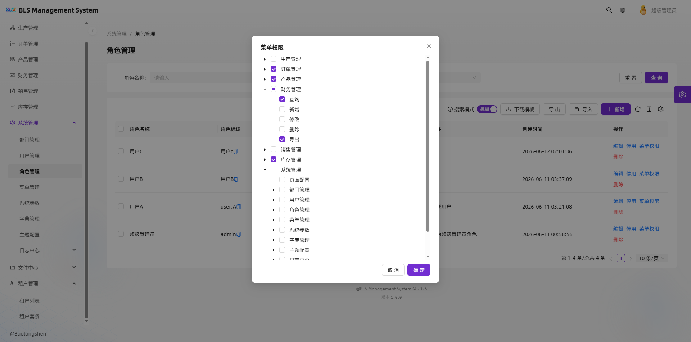
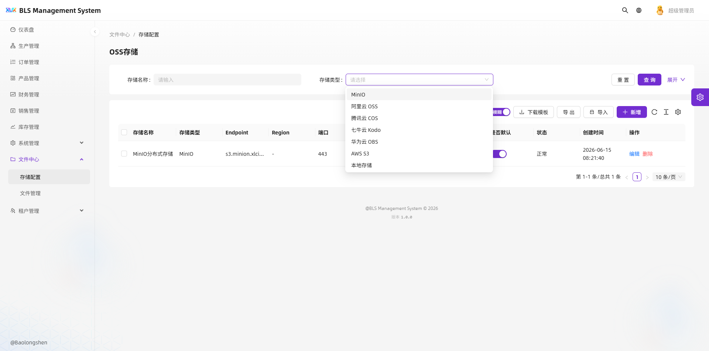

# BLS 系统总览文档

BLS 是一套面向多租户企业管理场景的后台系统，整体由前端管理端、后端服务端、数据库与运维支撑能力组成。系统围绕“平台统一治理、租户独立运营”的设计目标，提供权限控制、基础资料管理、业务管理、日志审计、文件存储、页面配置与实时能力等模块。

## 1. 系统目标

BLS 的核心目标是为企业提供一套可持续扩展的后台管理底座，支持多租户模式下的统一建设与差异化运营。

系统重点解决以下问题：

- 多租户之间的数据隔离与权限隔离
- 平台管理员、租户管理员、普通用户的角色区分
- 常见后台管理能力的标准化复用
- 业务模块快速接入与统一规范维护
- 具备可扩展的实时能力、导出能力和全局搜索能力

### 1.1 截图预览

#### 文件管理页


#### 上传弹窗


#### 系统设置页



#### 其他界面




### 1.3 多租户策略

系统没按照传统的 *** 来获取所有权限,根据超管的绝对权限去给自己配置所有权限，以防sql注入的安全性
也就是说，只有你登陆了超管账号才能正常赋予自己权限以及赋予其他子级子租户权限。所以每次的新菜单需要给超管
显示权限，因为接口层已经给超管开绿灯了，前端是权限xxx:xxx:xxx控制显隐

## 2. 系统组成

BLS 当前主要分为两个应用：

### 2.1 `bls-admin`

后台管理前端，基于 Ant Design Pro 构建，提供统一的系统入口和业务管理界面。

主要职责：

- 登录与权限展示
- 系统配置管理
- 用户、角色、部门、菜单管理
- 租户与套餐管理
- 文件、存储、日志管理
- 业务模块管理
- 页面配置与实时看板能力

### 2.2 `bls-server`

后端服务，基于 Koa + TypeScript + MySQL 构建，负责提供业务 API、鉴权、租户隔离、数据访问和系统支撑能力。

主要职责：

- JWT 登录与用户上下文
- 多租户请求处理
- RBAC 权限控制
- CRUD 接口与业务服务
- 全局搜索与实时消息
- 文件/Excel 等通用能力
- 数据库访问与事务处理

## 3. 技术栈

### 前端

- Ant Design Pro
- Ant Design
- TypeScript
- Umi / 相关企业级后台工程体系

### 后端

- Koa
- TypeScript
- MySQL
- Kysely（新业务优先使用）
- JWT
- WebSocket（实时能力）

### 数据与支撑

- MySQL 作为主数据库
- 租户上下文贯穿请求链路
- 统一日志与审计记录
- 文件存储与导入导出能力

## 4. 核心设计原则

### 4.1 多租户优先

系统默认按租户维度进行数据隔离。只要属于业务数据表，通常都需要考虑：

- `tenant_id` 过滤
- 平台管理员与租户用户的访问边界
- 共享数据与租户私有数据的区分

### 4.2 分层清晰

后端保持较明确的分层：

- `Controller`：接收请求、做参数校验、返回响应
- `Service`：负责业务逻辑与流程编排
- `Repository`：负责数据库访问
- `Model`：定义分页、表配置、DTO 等基础类型

### 4.3 新旧代码并行演进

系统历史上存在多种实现方式。当前策略是：

- 既有稳定模块保持原实现
- 新业务优先使用更现代的写法，例如 `Kysely`
- 统一通过约定逐步收敛实现风格

### 4.4 统一治理

系统尽量把通用能力收敛到公共模块中，包括：

- 鉴权
- 租户处理
- 错误处理
- 请求响应封装
- 审计日志
- 文件上传与导出
- 实时能力

## 5. 主要功能模块

### 5.1 基础系统模块

这部分是后台系统的核心管理能力，主要包括：

- 用户管理
- 角色管理
- 菜单管理
- 部门管理
- 字典管理
- 系统配置
- 主题配置
- 文件管理
- 存储配置
- 日志中心

### 5.2 租户与套餐模块

用于支撑多租户运营体系：

- 租户管理
- 租户套餐管理
- 租户状态控制
- 租户数据范围控制

### 5.3 业务模块

系统已扩展出业务场景相关模块，例如：

- 生产线
- 产品
- 订单
- 财务记录
- 销售记录
- 库存

这些模块通常遵循统一 CRUD 模式，并结合导入导出、页面配置、实时刷新等能力。

### 5.4 页面配置模块

页面配置用于统一管理前端页面的字段、展示方式和列表/表单配置，便于不同业务页面复用同一套配置逻辑。

### 5.5 全局搜索模块

提供跨模块检索能力，便于管理员快速定位系统中的关键数据或配置项。

### 5.6 实时能力

系统支持实时连接与状态同步，适合用于：

- 实时看板
- 状态更新
- 后台通知
- 运行态监控

### 5.7 通用工具能力

后端还提供了若干通用支撑能力，例如：

- Excel 导入导出
- 请求元数据记录
- IP 与访问上下文处理
- 统一缓存/会话支撑

## 6. 前后端协作方式

### 6.1 前端职责

前端负责：

- 路由与页面布局
- 表单、表格、弹窗等交互
- 权限菜单展示
- 接口调用与结果展示
- 页面配置和实时看板渲染

### 6.2 后端职责

后端负责：

- 提供 REST API
- 执行权限校验与租户隔离
- 维护数据一致性
- 处理导入导出、日志、实时消息
- 统一错误和响应格式

### 6.3 接口风格

接口通常遵循后台管理常见风格：

- 列表查询
- 详情查询
- 新增
- 编辑
- 删除
- 状态更新
- 导入/导出

## 7. 数据访问与开发规范

### 7.1 数据库访问

- 现有连接池和事务封装保持稳定
- 新业务优先使用 `Kysely`
- 旧模块可以逐步迁移，不要求一次性重构

### 7.2 查询规范

业务查询需要考虑：

- 软删除条件
- 租户条件
- 分页与排序
- 模糊搜索
- 条件过滤

### 7.3 代码组织规范

建议新功能按以下结构扩展：

- `controller`：接口入口
- `service`：业务逻辑
- `repository`：数据库访问
- `model`：类型定义
- `routes`：路由注册

## 8. 部署与运行概览

系统通常包含以下运行步骤：

1. 安装依赖
2. 配置环境变量
3. 初始化数据库
4. 启动后端服务
5. 启动前端管理端
6. 通过浏览器登录并验证权限与模块

## 9. 适用角色

BLS 主要面向以下角色：

- 平台管理员
- 租户管理员
- 业务管理员
- 系统维护人员
- 开发与测试人员

## 10. 文档使用建议

如果你是系统维护人员，建议优先阅读：

1. 本文档：了解系统整体结构
2. `bls-server/README.md`：了解后端开发与接入规范
3. `bls-admin/README.md`：了解前端页面组织与能力范围

如果你是开发人员，建议按模块继续补充更细的专题文档，例如：

- 接口文档
- 部署文档
- 权限模型文档
- 多租户设计文档
- 业务模块接入文档

---

## 10. 后端核心模块（动态配置）

### 10.1 `defineCrudModule` — 泛型 CRUD 工厂

**文件**：`bls-server/src/core/crud.ts`

只需一个配置对象即可生成完整的增删查改接口，自动包含租户隔离、软删除、权限校验。

```ts
import { defineCrudModule } from '../../core/crud';
export default defineCrudModule({
  prefix: '/system/role',       // 路由前缀
  table: 'sys_role',            // 数据库表名
  pkField: 'role_id',           // 主键字段
  searchFields: ['role_name'],  // 关键字搜索字段
  name: '角色',                 // 模块中文名（日志使用）
});
```

**自动生成的接口**：

| 方法 | 路径 | 说明 |
|------|------|------|
| `GET` | `/list` | 分页列表查询 |
| `GET` | `/:id` | 获取单条详情 |
| `POST` | `/add` | 新增记录 |
| `PUT` | `/edit` | 编辑记录 |
| `DELETE` | `/remove` | 删除记录（支持软删除/批量） |
| `PUT` | `/status` | 状态切换 |

**配置项 `CrudModuleConfig`**：

| 参数 | 类型 | 默认值 | 说明 |
|------|------|--------|------|
| `prefix` | `string` | 自动推导 | 路由前缀，如 `/system/role` |
| `table` | `string` | **必填** | 数据库表名 |
| `pkField` | `string` | **必填** | 主键字段名 |
| `tenantField` | `string` | `'tenant_id'` | 租户字段名 |
| `statusField` | `string` | `'status'` | 状态字段名 |
| `softDelete` | `boolean` | `true` | 是否软删除（设置 `deleted=1`） |
| `searchFields` | `string[]` | `[]` | 关键字搜索字段 |
| `name` | `string` | - | 模块中文名 |
| `permPrefix` | `string` | - | 权限前缀，如 `system:role` |
| `schema` | `{ create?, update? }` | - | Zod 校验 Schema |

**内置行为**：
- 自动按 `tenant_id` 隔离数据
- 自动处理 `snake_case` ↔ `camelCase` 转换
- 支持 `keyword` 模糊搜索 + 字段精确过滤
- 主键自动生成 Snowflake ID
- 分页参数 `pageNum` / `pageSize`（最大 100 条/页）

### 10.2 自动路由注册 `createRouter`

**文件**：`bls-server/src/core/router.ts`

**特性**：
- 自动扫描 `api/` 目录，无需手动注册路由
- 文件名自动映射为 HTTP 方法和路径（驼峰 → kebab）
  - `getList` → `GET /list`
  - `addUser` → `POST /add-user`
  - `removeItem` → `DELETE /remove-item`
- 导出 `config` 对象的模块自动调用 `defineCrudModule`
- 自动包裹 `jwtAuth()` 中间件，`public*` / `login` 等方法除外
- 统一 `snake_case` → `camelCase` 响应

### 10.3 统一响应封装

**文件**：`bls-server/src/core/response.ts`

```ts
// 普通成功响应
success(ctx, data, '操作成功');
// => { code: 200, message: '操作成功', data: ... }

// 分页响应
pageSuccess(ctx, rows, total, '查询成功');
// => { code: 200, message: '查询成功', data: [...], total: 100 }
```

### 10.4 错误体系

**文件**：`bls-server/src/core/errors.ts`

| 类名 | HTTP 状态码 | 说明 |
|------|-------------|------|
| `AppError` | 500 | 通用应用错误基类 |
| `UnauthorizedError` | 401 | 未登录/登录过期 |
| `SessionInvalidError` | 401 (code: 40101) | 会话失效 |
| `ForbiddenError` | 403 | 无访问权限 |
| `NotFoundError` | 404 | 资源不存在 |
| `ValidationError` | 400 | 参数校验错误（支持 Zod issues） |

### 10.5 数据库访问

**文件**：`bls-server/src/core/database.ts`

- **双连接池**：`pool`（传统 SQL）+ `getDb()`（Kysely，新业务优先）
- `getDb()` — 获取 Kysely 实例（单例，自动包装重试机制）
- `query<T>(sql, params)` — 执行查询返回 `T[]`
- `queryOne<T>(sql, params)` — 查询单条记录
- `execute(sql, params)` — 执行写操作
- `transaction(runner)` — 事务执行，自动 commit/rollback
- **自动重试**：遇到 `ECONNRESET` 等连接错误自动重试（最多 3 次，指数退避）

### 10.6 审计日志

**文件**：`bls-server/src/core/audit.ts`

| 函数 | 说明 |
|------|------|
| `getAuditActor(ctx)` | 从 Koa 上下文提取操作者信息 |
| `writeOperationLog(input)` | 写入操作日志（`sys_operation_log`） |
| `writeUploadAudit(input)` | 写入上传审计日志（`sys_upload_audit`） |
| `writeLoginLog(input)` | 写入登录日志（`sys_login_log`） |

### 10.7 SQL 辅助

**文件**：`bls-server/src/core/sql.ts`

```ts
// 拼接 WHERE 条件
joinConditions([...])

// LIKE 条件（自动处理空值）
likeCondition('name', 'name', value)
// => { sql: "name LIKE :name", params: { name: "%xxx%" } }

// 等值条件（自动处理空值）
eqCondition('status', 'status', value)
// => { sql: "status = :status", params: { status: 1 } }
```

---

## 11. 前端核心组件

### 11.1 `CrudTablePage` — 泛型 CRUD 表格页面

**文件**：`bls-admin/src/components/CrudTablePage/index.tsx`

最重要的业务组件，整合了 ProTable + BetaSchemaForm，一个组件覆盖"列表 + 新增/编辑弹窗 + 删除 + 状态切换 + 批量删除 + 导入导出"。

**最简用法**：

```tsx
export default function OrderPage() {
  return (
    <CrudTablePage<OrderRecord>
      title="订单管理"
      rowKey="id"
      resource={{ basePath: '/api/business/orders' }}
      columns={columns}
      formColumns={formColumns}
    />
  );
}
```

**完整 Props**：

| 属性 | 类型 | 默认值 | 说明 |
|------|------|--------|------|
| `title` | `string` | **必填** | 页面标题 |
| `rowKey` | `keyof T` | **必填** | 主键字段 |
| `resource` | `CrudResource` | **必填** | 接口资源对象 `{ basePath: '/api/xxx' }` |
| `columns` | `ProColumns<T>[]` | **必填** | 表格列定义 |
| `formColumns` | `ProFormColumnsType<T>[]` | **必填** | 表单列定义 |
| `columnConfig` | `CrudTablePageColumnConfig<T>[]` | - | 列可见/可搜索控制 |
| `statusKey` | `keyof T` | `'status'` | 状态字段 |
| `createButtonText` | `string` | `'新增'` | 新增按钮文本 |
| `showCreateButton` | `boolean` | `true` | 是否显示新增按钮 |
| `showEditAction` | `boolean` | `true` | 是否显示编辑操作 |
| `showFormModal` | `boolean` | `true` | 是否显示表单弹窗 |
| `modalWidth` | `number` | `640` | 弹窗宽度 |
| `embedded` | `boolean` | `false` | 内嵌模式（不包裹 PageContainer） |
| `defaultSearchMode` | `'fuzzy' \| 'exact'` | `'fuzzy'` | 默认搜索模式 |
| `showSearchModeToggle` | `boolean` | `true` | 显示搜索模式切换 |
| `permissions` | `object` | - | 权限控制 `{ create?, edit?, remove?, status?, import?, export? }` |
| `excelMetaKey` | `string` | - | Excel 导入导出元键 |
| `beforeSubmit` | `(values, current?) => Partial<T>` | - | 提交前数据转换 |
| `onSaved` | `(mode, values, current?) => void` | - | 保存成功回调 |
| `extraActions` | `(record: T) => ReactNode[]` | - | 额外操作按钮 |
| `toolbarExtra` | `ReactNode[]` | - | 工具栏额外节点 |
| `pagination` | `false \| object` | `{ defaultPageSize: 10, showSizeChanger: true }` | 分页配置 |
| `scroll` | `{ x?, y? }` | - | 表格滚动 |
| `expandable` | `object` | - | 展开行配置 |
| `formGrid` | `boolean` | `true` | 表单网格布局 |
| `formColProps` | `object` | `{ xs: 24, md: 12 }` | 表单项栅格 |

**内置智能处理**：
- **valueEnum 列**自动用 `<Tag>` 渲染（而非默认 Badge 圆点）
- **状态切换**：valueEnum >= 2 个值时，操作列显示循环切换按钮
- **表单归一化**：
  - `switch` 类型 → 自动转换 0/1 为 boolean
  - JSON 字段（`xxxJson` + textarea）→ 自动格式化缩进
  - `select/treeSelect` 多选 → 字符串按逗号拆分为数组
  - 单选 select → 值统一转字符串
- **批量删除**：自动开启行选择 + 底部批量操作栏
- **权限控制**：通过 `usePermission` 控制各按钮显隐
- **搜索模式**：模糊模式合并所有字段为 `keyword`，精确模式按字段原样传参

### 11.2 `ExcelToolbar` — 导入导出工具栏

**文件**：`bls-admin/src/components/ExcelToolbar/index.tsx`

| 属性 | 类型 | 说明 |
|------|------|------|
| `metaKey` | `string` | Excel 元键，标识数据实体 |
| `queryParams` | `Record<string, any>` | 导出时的查询参数 |

**功能**：
- 下载模板 → `GET /api/common/excel/template`
- 导出数据 → `POST /api/common/excel/export`（支持全部/自定义条数）
- 导入数据 → `POST /api/common/excel/import`（拖拽上传 .xlsx/.xls）
- 导入结果展示成功/失败统计和错误详情

### 11.3 `ErrorBoundary` — 错误边界

**文件**：`bls-admin/src/components/ErrorBoundary/index.tsx`

```tsx
<ErrorBoundary>
  <YourPage />
</ErrorBoundary>
```

- 捕获子组件渲染错误，显示友好错误页面
- 区分 ChunkLoadError（JS 分片加载失败）和普通渲染错误
- Chunk 错误离线检测：网络恢复时自动重试
- 提供 Retry、Reload、Back Home 操作

### 11.4 `IconPicker` — 图标选择器

**文件**：`bls-admin/src/components/IconPicker/index.tsx`

```tsx
<IconPicker value={iconName} onChange={setIcon} />
```

| 属性 | 类型 | 说明 |
|------|------|------|
| `value` | `string` | 当前图标名 |
| `onChange` | `(value?: string) => void` | 值变化回调 |
| `placeholder` | `string` | 占位文本 |
| `trigger` | `ReactNode` | 自定义触发器 |

功能：搜索 Ant Design Outlined 图标，网格展示，支持清空和确认。

### 11.5 `FileUploadModal` — 文件上传弹窗

**文件**：`bls-admin/src/components/FileUploadModal/index.tsx`

```tsx
<FileUploadModal
  open={open}
  onOpenChange={setOpen}
  onUploaded={(res) => console.log(res)}
  accept="image/*"
/>
```

| 属性 | 类型 | 默认值 | 说明 |
|------|------|--------|------|
| `open` | `boolean` | **必填** | 弹窗开关 |
| `onOpenChange` | `(open: boolean) => void` | **必填** | 开关回调 |
| `onUploaded` | `(res: any) => void` | - | 上传成功回调 |
| `uploadUrl` | `string` | `/api/system/storage/upload` | 上传接口 |
| `accept` | `string` | - | 文件类型限制 |
| `extraData` | `Record<string, string>` | - | 额外参数 |

### 11.6 `RichTextEditor` — 富文本编辑器

**文件**：`bls-admin/src/components/RichTextEditor/index.tsx`

基于 wangeditor，支持受控/非受控模式、图片上传、只读模式。

### 11.7 其他组件

| 组件 | 说明 |
|------|------|
| `GlobalRealtimeProvider` | 全局 WebSocket 实时连接提供者 |
| `DashboardRealtimeCard` | 实时看板卡片组件 |
| `OfflineBanner` | 离线状态提示横幅 |
| `VersionDropdown` | 版本切换下拉 |

---

## 12. 前端 Hooks

### 12.1 `useCrudTable` — CRUD 状态管理 Hook

**文件**：`bls-admin/src/hooks/useCrudTable.ts`

```ts
const crud = useCrudTable<UserRow>(resource, 'id', {
  beforeSubmit: (values, current) => ({ ...values, remark: values.remark?.trim() }),
  onSaved: (mode, values, current) => refreshOther(),
  searchMode: 'fuzzy',
});
```

**参数**：

| 参数 | 类型 | 说明 |
|------|------|------|
| `resource` | `CrudResource` | CRUD 资源对象 |
| `idKey` | `keyof T` | 主键字段名 |
| `options.beforeSubmit` | `(values, current?) => Partial<T>` | 提交前转换 |
| `options.onSaved` | `(mode, values, current?) => void` | 保存成功回调 |
| `options.searchMode` | `'fuzzy' \| 'exact'` | 搜索模式 |

**返回值**：

| 属性 | 类型 | 说明 |
|------|------|------|
| `actionRef` | `Ref<ActionType>` | ProTable action 引用 |
| `lastRequestParams` | `Ref<object>` | 最近一次请求参数 |
| `modalOpen` | `boolean` | 弹窗是否打开 |
| `mode` | `'create' \| 'edit'` | 当前模式 |
| `current` | `T \| undefined` | 当前编辑行数据 |
| `createDefaults` | `Partial<T> \| undefined` | 新增默认值 |
| `request` | `(params) => Promise` | 列表请求函数（给 ProTable） |
| `openCreate(defaults?)` | `void` | 打开新增弹窗 |
| `openEdit(record)` | `void` | 打开编辑弹窗 |
| `closeModal()` | `void` | 关闭弹窗 |
| `submit(values)` | `Promise<boolean>` | 提交表单 |
| `remove(records)` | `void` | 删除（含确认弹窗） |
| `changeStatus(record, status)` | `Promise<void>` | 切换状态 |

### 12.2 `usePermission` — 权限控制 Hook

**文件**：`bls-admin/src/hooks/usePermission.ts`

```ts
// 方式一：传入所需权限
const { hasPermission, isAdmin } = usePermission('user:edit');

// 方式二：动态判断
const { can } = usePermission();
if (can('user:delete')) { /* 有权限 */ }

// 多权限 AND / OR
can(['user:create', 'user:edit'], 'all');  // 全部满足
can(['user:create', 'user:edit'], 'any');  // 任一满足
```

**返回值**：

| 属性 | 类型 | 说明 |
|------|------|------|
| `isAdmin` | `boolean` | 是否为超管（超管默认拥有所有权限） |
| `userPerms` | `string[]` | 当前用户权限列表 |
| `hasPermission` | `boolean` | 是否拥有指定权限 |
| `can(perm, mode?)` | `boolean` | 动态权限判断 |

### 12.3 `useDict` — 字典数据 Hook

**文件**：`bls-admin/src/hooks/useDict.ts`

```ts
// 单个字典
const { options, valueEnum, loading, getLabel, refresh } = useDict('sys_yes_no');

// 多个字典批量加载
const result = useMultiDict(['sys_yes_no', 'order_status'] as const);
// result.sys_yes_no.options / result.order_status.valueEnum / result.loading
```

**返回值**（`useDict`）：

| 属性 | 类型 | 说明 |
|------|------|------|
| `options` | `{ label, value }[]` | 下拉选项 |
| `valueEnum` | `Record<string, {text, color?}>` | 适用于 ProTable valueEnum |
| `loading` | `boolean` | 加载状态 |
| `getLabel(value)` | `string` | 根据 value 获取 label |
| `refresh()` | `void` | 清除缓存并重新加载 |

### 12.4 `usePageConfig` — 页面动态配置 Hook

**文件**：`bls-admin/src/hooks/usePageConfig.ts`

从服务端加载页面列配置，自动生成 ProTable columns 和 Form columns。

```ts
const { proColumns, formColumns, loading } = usePageConfig('order_page');
```

**返回值**：

| 属性 | 类型 | 说明 |
|------|------|------|
| `columns` | `PageColumnConfigRecord[]` | 原始列配置 |
| `proColumns` | `ProColumns[]` | 适配 ProTable 的列（自动过滤 visible=false） |
| `formColumns` | `ProFormColumnsType[]` | 适配表单的列（自动过滤 editable=false） |
| `loading` | `boolean` | 加载状态 |

### 12.5 `useFileUpload` — 文件上传 Hook

**文件**：`bls-admin/src/hooks/useFileUpload.ts`

```ts
const { uploading, upload } = useFileUpload({
  uploadUrl: '/api/system/storage/upload',
  onSuccess: (result) => console.log(result.url),
});

await upload({ file: blob, filename: 'photo.png', data: { accessType: 'private' } });
```

**选项**：

| 参数 | 类型 | 默认值 | 说明 |
|------|------|--------|------|
| `uploadUrl` | `string` | `/api/system/storage/upload` | 上传地址 |
| `defaultData` | `Record<string, string>` | - | 默认附带参数 |
| `transformResponse` | `(res) => NormalizedUploadResult` | 自动提取 url/fileId 等 | 响应转换 |
| `onSuccess` | `(result) => void` | - | 上传成功回调 |
| `onError` | `(error) => void` | - | 上传失败回调 |

**返回值**：

| 属性 | 类型 | 说明 |
|------|------|------|
| `uploading` | `boolean` | 上传中状态 |
| `upload({file, filename, data})` | `Promise<NormalizedUploadResult>` | 执行上传 |

### 12.6 `useWebSocket` — WebSocket 实时连接 Hook

**文件**：`bls-admin/src/hooks/useWebSocket.ts`

```ts
const { connected, connecting, lastMessage, errorText, reconnect } = useWebSocket({
  url: 'ws://localhost:6001/ws/realtime',
  onMessage: (msg) => handleRealTimeData(msg),
});
```

**选项**：

| 参数 | 类型 | 默认值 | 说明 |
|------|------|--------|------|
| `url` | `string` | **必填** | WebSocket 地址 |
| `heartbeatIntervalMs` | `number` | `15000` | 心跳间隔 |
| `reconnectDelayMs` | `number` | `3000` | 重连延迟 |
| `maxReconnectAttempts` | `number` | `5` | 最大重连次数 |
| `tokenStorageKey` | `string` | `'token'` | Token 存储 key |
| `enabled` | `boolean` | `true` | 是否启用连接 |
| `onOpen` | `(socket) => void` | - | 连接打开回调 |
| `onMessage` | `(msg) => void` | - | 消息回调 |

**返回值**：

| 属性 | 类型 | 说明 |
|------|------|------|
| `connected` | `boolean` | 是否已连接 |
| `connecting` | `boolean` | 连接中 |
| `errorText` | `string \| null` | 错误信息 |
| `lastMessage` | `TMessage \| null` | 最新消息 |
| `reconnect()` | `void` | 手动重连 |

---

## 13. 快速接入指南

### 新增一个 CRUD 模块的步骤

**后端（3 步）**：

```ts
// 1. 在 bls-server/src/api/ 下创建文件夹和 index.ts
// bls-server/src/api/business/orders/index.ts
export default {
  table: 'orders',
  pkField: 'id',
  searchFields: ['order_no', 'customer_name'],
  name: '订单',
  permPrefix: 'business:order',
};
```

路由自动注册，接口自动生成：`GET /api/business/orders/list`、`POST /api/business/orders/add` 等。

**前端（1 个组件搞定）**：

```tsx
// 2. 在 bls-admin/src/pages/business/orders/index.tsx
export default function OrderPage() {
  return (
    <CrudTablePage<OrderRecord>
      title="订单管理"
      rowKey="id"
      resource={{ basePath: '/api/business/orders' }}
      columns={columns}
      formColumns={formColumns}
      excelMetaKey="orders"
      permissions={{ create: 'business:order:add', edit: 'business:order:edit', remove: 'business:order:remove' }}
    />
  );
}
```

---

## 其他文档参见

- [CurdTable 及其 hook 封装文档](./CurdTable及其hook封装文档.md)
- [存储桶通用文档](./存储桶通用文档.md)
- [系统多开策略及单开策略文档](./系统多开策略及单开策略文档.md)
- [全局搜索策略文档](./全局搜索技术文档.md)

