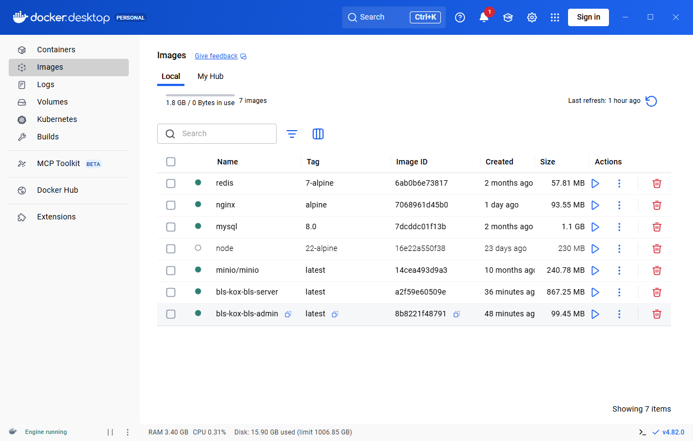
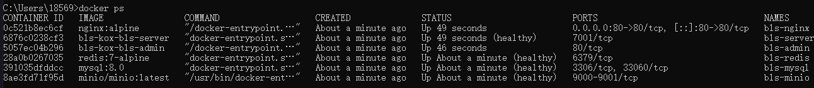
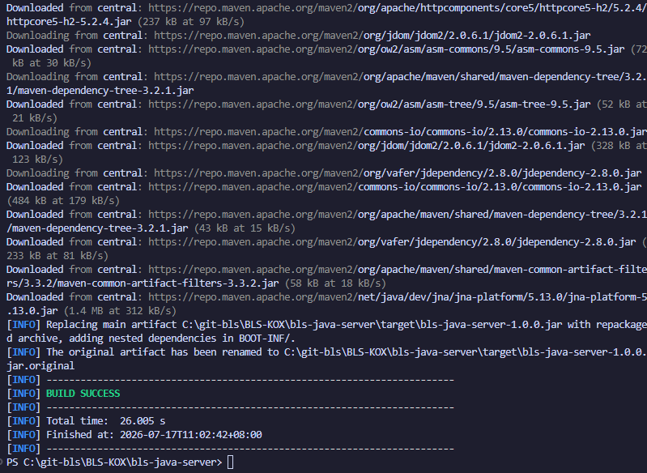
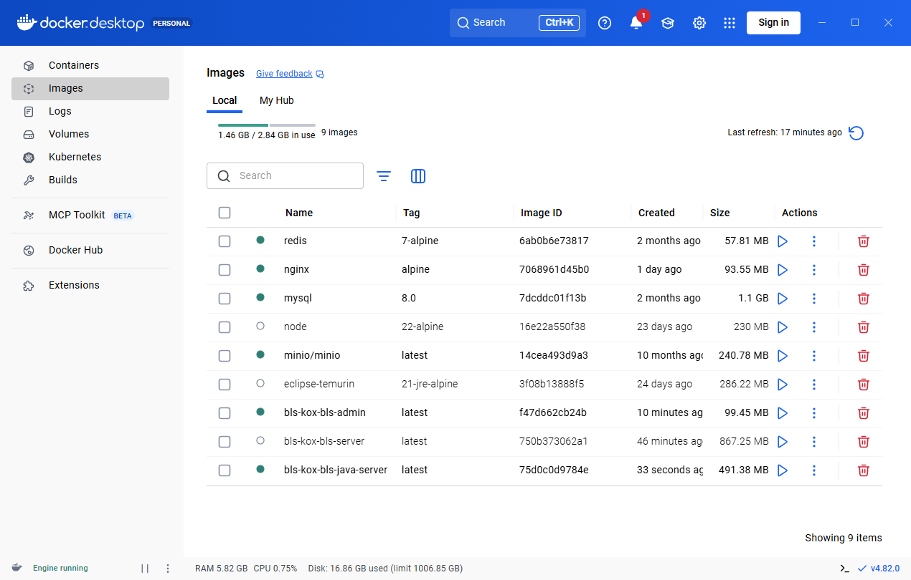
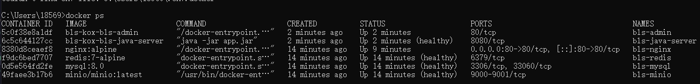

# BLS-KOX Docker 部署指南

## 前置条件

- Docker Desktop 已安装并运行
- 已配置 Docker 镜像加速器（国内必需，见下方故障排查）

---

## 方式一：Koa 后端（默认）

Koa 后端是默认后端，一条命令启动所有服务。

### 快速启动

```powershell
# 进入项目目录
cd c:\git-bls\BLS-KOX

# 一条命令启动所有服务
docker compose --env-file .env.docker down -v --remove-orphans && docker compose --env-file .env.docker up -d --build
```

### 验证成功

```powershell
docker compose ps
```

全部 `Up` (healthy) 即为成功：

```
NAME             STATUS
bls-admin        Up
bls-ai-service   Up (healthy)
bls-minio        Up (healthy)
bls-mysql        Up (healthy)
bls-nginx        Up
bls-redis        Up (healthy)
bls-server       Up (healthy)
```





### 访问地址

| 服务 | 地址 | 说明 |
|------|------|------|
| 前端管理台 | http://localhost | Nginx 统一入口 |
| KOX-AI 对话 | http://localhost → 菜单「KOX-AI」 | AI 智能助手 |
| MinIO 控制台 | http://localhost:9001 | 对象存储管理 |
| API 健康检查 | http://localhost/api/health | 后端健康状态 |

### 默认账号

| 角色 | 用户名 | 密码 |
|------|--------|------|
| 超级管理员 | `superadmin` | `123456` |
| 租户管理员 | `admin` | `123456` |
| MinIO 管理 | `minioadmin` | `minioadmin` |

---

## 方式二：Java 后端

Java 后端使用 Spring Boot 3 + Java 21，通过独立的 compose 覆盖文件启动。

### 1. 编译 Java 项目

```powershell
cd bls-java-server
mvn clean package -DskipTests
```

编译成功后在 `target/` 目录生成 `bls-java-server-1.0.0.jar`。



### 2. 拉取 Java 基础镜像（如网络不通则手动拉）

```powershell
docker pull eclipse-temurin:21-jre-alpine
```

> 如果 `eclipse-temurin` 拉不下来，可换用 `amazoncorretto:21-alpine`，需同步修改 `bls-java-server/Dockerfile` 第一行。

### 3. 启动 Java 后端

```powershell
# 回到项目根目录
cd ..

# 停止当前 Koa 服务，启动 Java 版
docker compose --env-file .env.docker down
docker compose --env-file .env.docker -f docker-compose.yml -f docker-compose.java.yml up -d --build
```

### 验证成功

```powershell
docker compose --env-file .env.docker ps
```

全部 `Up` (healthy) 即为成功：

```
NAME              STATUS
bls-admin         Up
bls-java-server   Up (healthy)
bls-minio         Up (healthy)
bls-mysql         Up (healthy)
bls-nginx         Up
bls-redis         Up (healthy)
```





### 4. 切回 Koa 后端

```powershell
docker compose --env-file .env.docker down
docker compose --env-file .env.docker up -d --build
```

### Java 版架构说明

Java 版通过 `docker-compose.java.yml` 覆盖文件实现：
- **自动切换 nginx 配置**：使用 `nginx-java.conf`，upstream 指向 `bls-java-server:8080`
- **自动停止 Koa**：`bls-server` replicas 设为 0
- **激活 Docker Profile**：`SPRING_PROFILES_ACTIVE=docker`，Java 从环境变量读取数据库/Redis/JWT 配置
- **不影响原始配置**：`application.yml` 保持服务器配置不变，Docker 用 `application-docker.yml` 覆盖

### Koa 与 Java 切换对照表

| | Koa（默认） | Java |
|------|-----------|------|
| **启动命令** | `docker compose --env-file .env.docker up -d --build` | `docker compose --env-file .env.docker -f docker-compose.yml -f docker-compose.java.yml up -d --build` |
| **后端容器** | `bls-server:7001` | `bls-java-server:8080` |
| **AI 服务** | `bls-ai-service:7201`（默认启动） | 同样可用 |
| **nginx 配置** | `nginx.conf` | `nginx-java.conf` |
| **接口文档** | 需本地开发模式查看 | Swagger UI: `http://localhost:8080/swagger-ui.html` |
| **WebSocket** | 支持 | 暂不支持 |

---

## 服务架构

```
Browser → Nginx(80) → bls-admin(前端 SPA)
                    → bls-server(:7001) 或 bls-java-server(:8080)
                    → minio(对象存储 :9000)

后端 → mysql(3306) + redis(6379) + minio(9000)
```

### 容器清单

| 容器 | 镜像 | 端口 | 说明 |
|------|------|------|------|
| bls-nginx | nginx:alpine | 80 | 反向代理 |
| bls-admin | 构建 | - | 前端 SPA |
| bls-server | 构建 | 7001 | 后端 Koa（默认） |
| bls-ai-service | 构建 | 7201 | AI 对话服务（流式 SSE） |
| bls-java-server | 构建 | 8080 | 后端 Java（可选） |
| bls-mysql | mysql:8.0 | 3306 | 数据库 |
| bls-redis | redis:7-alpine | 6379 | 缓存 |
| bls-minio | minio/minio | 9000/9001 | 对象存储 |
| bls-minio-init | minio/minio | - | 初始化 Bucket（用完退出） |

---

## 常用命令

### 查看状态

```powershell
docker compose --env-file .env.docker ps
```

### 查看日志

```powershell
# 所有服务
docker compose logs -f

# 单个服务
docker compose logs -f bls-server
```

### 完整重建（清数据）

```powershell
docker compose --env-file .env.docker down -v --remove-orphans
docker compose --env-file .env.docker up -d --build
```

### 停止服务

```powershell
docker compose --env-file .env.docker down
```

---

## 环境变量说明

配置文件：`.env.docker`

| 变量 | 说明 | 示例 |
|------|------|------|
| DB_HOST | 数据库地址 | mysql |
| DB_PORT | 数据库端口 | 3306 |
| DB_USER | 数据库用户 | root |
| DB_PASSWORD | 数据库密码 | 自定义 |
| DB_NAME | 数据库名 | kox |
| REDIS_HOST | Redis 地址 | redis |
| REDIS_PORT | Redis 端口 | 6379 |
| REDIS_PASSWORD | Redis 密码 | 自定义 |
| JWT_SECRET | JWT 签名密钥 | 至少 32 位 |
| CORS_ORIGINS | 允许的跨域域名 | http://localhost |
| API_SIGN_SECRET | 防重放签名密钥 | 自定义 |
| **AI 服务** | | |
| AI_PROVIDER | AI 提供商 | deepseek / openai |
| AI_MODEL | AI 模型名称 | deepseek-chat / gpt-4o-mini |
| OPENAI_API_KEY | AI API 密钥 | 从平台获取 |
| AI_BASE_URL | AI API 自定义地址 | 可选，默认用官方地址 |

---

## 故障排查

### 502 Bad Gateway

```powershell
docker compose --env-file .env.docker restart bls-nginx
```

### 数据库数据不完整

```powershell
docker compose --env-file .env.docker down -v --remove-orphans
docker compose --env-file .env.docker up -d --build
```

### 镜像拉取失败

在 Docker Desktop 设置中配置镜像加速器：

```json
{
  "registry-mirrors": [
    "https://docker.1ms.run",
    "https://docker.xuanyuan.me"
  ]
}
```

如果配置加速器后仍无法拉取某些镜像，手动逐个拉取：

```powershell
docker pull node:22-alpine
docker pull nginx:alpine
docker pull mysql:8.0
docker pull redis:7-alpine
docker pull minio/minio:latest
docker pull eclipse-temurin:21-jre-alpine
```

### MinIO 图片 403

```powershell
docker exec bls-minio mc anonymous set public local/public-assets
```

### 图片 CSP 拦截

检查 `public_base_url` 配置是否正确（应为 `/files`）：

```powershell
docker exec bls-mysql mysql -uroot -p"${DB_PASSWORD}" kox -e "SELECT public_base_url FROM sys_storage_config WHERE storage_id='000001';"
```
