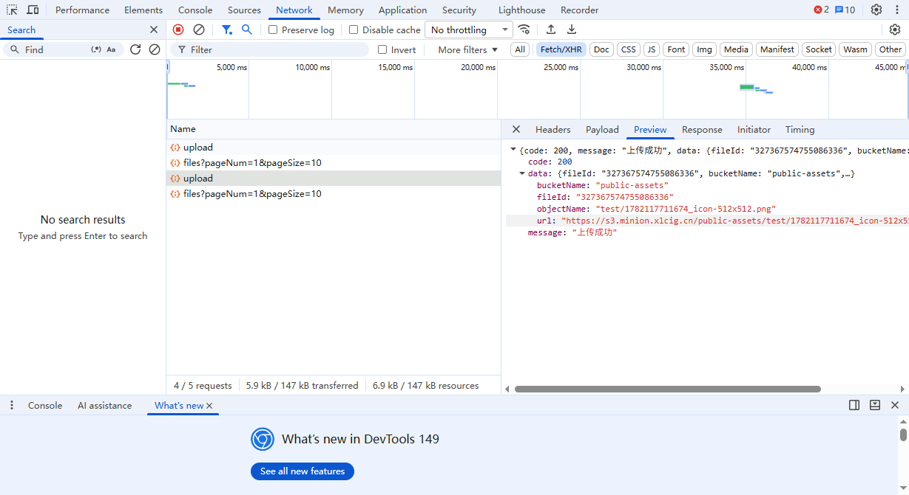
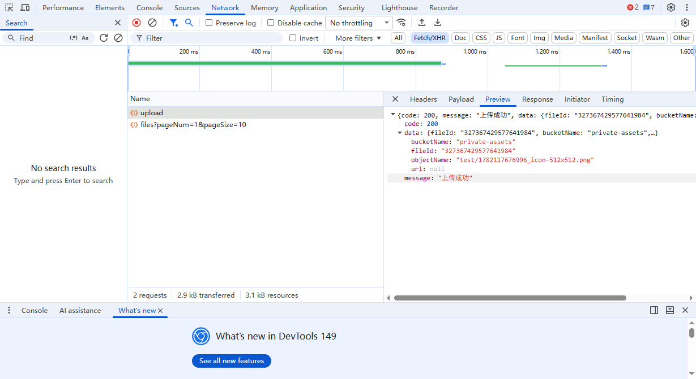
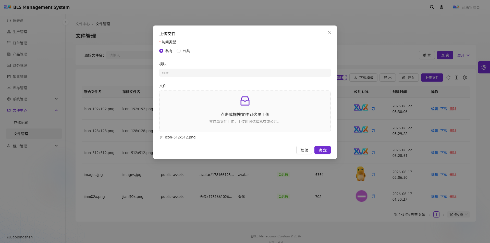

# 存储桶通用文档

本文档用于说明系统的对象存储配置方式，重点介绍 **MinIO**，其次说明 **阿里云 OSS** 的接入方法。目标是让系统在不同环境下都能统一使用“上传、下载、预览、删除”这套能力，而不关心底层具体是 MinIO 还是 OSS。

## 1. 存储方案说明

系统当前建议支持以下几种存储方式：

- **本地存储**：适合开发或单机测试环境
- **MinIO**：推荐用于私有化部署、内网部署、测试环境、生产环境
- **阿里云 OSS**：适合已经使用阿里云生态的公网环境

从系统设计上看，存储层只要对外暴露统一的文件操作接口即可，后端根据配置决定使用哪一种存储服务。

## 2. 统一配置思路

系统里的存储参数应当**从后端接口获取**，通常来源于“存储配置”接口或配置管理页面，而不是前端或业务代码写死。

建议把存储配置抽象为以下几个核心字段：

- `provider`：存储类型，例如 `local`、`minio`、`oss`
- `endpoint`：存储服务地址
- `bucket`：桶名称
- `accessKey`：访问密钥 ID
- `secretKey`：访问密钥 Secret
- `region`：区域信息，OSS 常用，MinIO 可选
- `useSsl`：是否使用 HTTPS
- `domain`：文件访问域名，可用于生成外链
- `prefix`：文件前缀目录，可选
- `pathStyle`：是否使用路径风格访问，MinIO 常用

前端页面只负责展示和选择存储配置，不应该直接写死 MinIO 或 OSS 的连接信息。真正的对象存储连接参数，应当由后端从数据库配置表、配置接口或系统管理模块中读取后再使用。

## 3. MinIO 配置

### 3.1 MinIO 适用场景

MinIO 适合以下情况：

- 公司内网部署
- 私有化交付
- 开发、测试环境
- 需要兼容 S3 协议的场景

MinIO 的优点是：

- 部署简单
- 成本低
- 与 S3 接口兼容度高
- 便于自建和运维

### 3.2 MinIO 基本配置项

常见配置如下：

- `endpoint`：MinIO 服务地址，例如 `http://127.0.0.1:9000`
- `bucket`：桶名称，例如 `bls-files`
- `accessKey`：访问密钥
- `secretKey`：访问密钥密文
- `useSsl`：是否启用 HTTPS，一般本地开发可设为 `false`
- `pathStyle`：建议设为 `true`
- `domain`：外部访问域名，例如 `https://static.example.com`，如果没有独立域名，可直接使用 MinIO 地址

### 3.3 MinIO 示例配置

#### 环境变量方式

```env
STORAGE_PROVIDER=minio
MINIO_ENDPOINT=http://127.0.0.1:9000
MINIO_BUCKET=bls-files
MINIO_ACCESS_KEY=minioadmin
MINIO_SECRET_KEY=minioadmin123
MINIO_USE_SSL=false
MINIO_PATH_STYLE=true
MINIO_DOMAIN=http://127.0.0.1:9000/bls-files
```

#### 配置文件方式

```json
{
  "provider": "minio",
  "endpoint": "http://127.0.0.1:9000",
  "bucket": "bls-files",
  "accessKey": "minioadmin",
  "secretKey": "minioadmin123",
  "useSsl": false,
  "pathStyle": true,
  "domain": "http://127.0.0.1:9000/bls-files"
}
```

### 3.4 MinIO 桶配置建议

建议创建独立桶用于系统文件，例如：

- `bls-files`：业务上传文件
- `bls-avatar`：头像文件
- `bls-temp`：临时文件

如果系统比较简单，也可以统一使用一个桶，通过 `prefix` 区分目录：

- `avatar/`
- `contract/`
- `attachment/`
- `temp/`

### 3.5 MinIO 注意事项

1. **桶权限**
   - 如果文件需要公开访问，桶或对象需要设置为可读
   - 如果文件只允许登录后访问，建议由后端生成临时访问链接

2. **路径风格访问**
   - MinIO 通常建议开启 `pathStyle=true`
   - 否则在某些部署环境下可能无法正常访问

3. **域名配置**
   - 如果前端需要直接展示图片，建议配置独立域名
   - 例如 `https://static.xxx.com`

4. **HTTPS**
   - 生产环境建议开启 HTTPS
   - 如果 MinIO 前面挂了 Nginx，可以统一由 Nginx 提供 HTTPS

## 4. 阿里云 OSS 配置

### 4.1 OSS 适用场景

阿里云 OSS 适合以下情况：

- 系统部署在阿里云上
- 需要稳定的公网对象存储
- 需要成熟的云服务生态
- 需要和 CDN、WAF、云解析等配合使用

### 4.2 OSS 基本配置项

常见配置如下：

- `endpoint`：OSS 访问域名，例如 `oss-cn-hangzhou.aliyuncs.com`
- `bucket`：桶名称
- `accessKey`：阿里云 AccessKey ID
- `secretKey`：阿里云 AccessKey Secret
- `region`：地域，例如 `cn-hangzhou`
- `domain`：自定义绑定域名，可选
- `prefix`：对象前缀目录，可选

### 4.3 OSS 示例配置

#### 环境变量方式

```env
STORAGE_PROVIDER=oss
OSS_ENDPOINT=oss-cn-hangzhou.aliyuncs.com
OSS_BUCKET=bls-files
OSS_ACCESS_KEY_ID=your-access-key-id
OSS_ACCESS_KEY_SECRET=your-access-key-secret
OSS_REGION=cn-hangzhou
OSS_DOMAIN=https://static.example.com
```

#### 配置文件方式

```json
{
  "provider": "oss",
  "endpoint": "oss-cn-hangzhou.aliyuncs.com",
  "bucket": "bls-files",
  "accessKey": "your-access-key-id",
  "secretKey": "your-access-key-secret",
  "region": "cn-hangzhou",
  "domain": "https://static.example.com"
}
```

### 4.4 OSS 注意事项

1. **Bucket 权限**
   - 可设为私有桶，由后端签名访问
   - 也可设为公共读，适合静态资源展示

1.1 **返回预览**

系统在上传完成后，通常会返回“文件信息 + 访问地址 + 预览相关字段”。下面这三张图分别对应不同的返回场景：







### 返回字段原因说明

通常建议返回以下字段：

- `id`：文件记录主键，便于后续做编辑、删除、详情查询
- `name`：原始文件名，方便前端展示给用户
- `url`：可直接访问的文件地址，前端可直接用于图片、附件预览
- `path` / `fileKey`：对象存储中的真实路径，后端删除、迁移、签名访问时都需要它
- `bucket`：桶名称，方便区分不同存储桶或排查问题
- `provider`：存储类型，用于标识当前文件来自 MinIO 还是 OSS
- `size`：文件大小，便于前端展示和限制判断
- `contentType`：文件类型，便于预览、下载和判断是否为图片
- `etag` / `md5`：用于校验重复上传或完整性校验
- `expireAt`：私有文件签名过期时间，便于前端判断链接是否需要重新获取
- `previewUrl`：预览地址，适合私有桶或需要单独签名的场景

不同返回模式下，字段会略有差异：

- **公共读文件**：通常直接返回 `url`，前端可直接展示
- **私有文件**：通常返回 `previewUrl` 或临时签名地址，`url` 可能只是对象路径，不可直接访问
- **统一文件列表**：通常会保留 `path/fileKey`，让后端能继续处理删除、重命名、迁移等操作

2. **自定义域名**
   - 推荐绑定自定义域名，避免直接暴露 OSS 原始域名
   - 如果业务有图片、附件预览需求，自定义域名更稳定

3. **区域必须匹配**
   - `bucket` 所在地域与 `endpoint` 必须对应
   - 否则可能出现签名失败或上传失败

4. **跨域访问**
   - 前端直接上传到 OSS 时，要配置 CORS
   - 如果由后端代理上传，则一般不需要额外配置浏览器跨域

## 5. 系统如何切换存储

建议系统按以下方式实现切换：

### 5.1 后端统一封装存储接口

例如统一提供：

- `upload(file)`
- `download(fileKey)`
- `delete(fileKey)`
- `getUrl(fileKey)`
- `generatePresignedUrl(fileKey)`

业务层只调用这些接口，不直接依赖 MinIO SDK 或 OSS SDK。

### 5.2 通过后端存储配置决定实现

例如后端先从“存储配置接口”取到当前配置，再根据返回值决定使用哪一种实现：

- `provider=minio` 时使用 MinIO 实现
- `provider=oss` 时使用 OSS 实现
- `provider=local` 时使用本地磁盘实现

也就是说，切换不是靠用户手动改代码，而是靠后台维护存储配置后自动生效。

### 5.3 推荐的目录结构

```text
storage/
  index.ts
  local.ts
  minio.ts
  oss.ts
  types.ts
```

其中：

- `types.ts` 定义统一接口
- `index.ts` 负责根据配置选择实现
- `minio.ts` 封装 MinIO SDK
- `oss.ts` 封装阿里云 OSS SDK
- `local.ts` 处理本地文件

## 6. 前端展示和访问方式

如果系统上传后需要在前端直接访问，通常有两种方式：

### 6.1 直接返回完整 URL

后端上传成功后直接返回文件 URL，例如：

```text
https://static.example.com/avatar/2026/06/abc.png
```

优点：前端简单。

### 6.2 只返回对象 Key，由后端拼接域名

后端只返回：

```text
avatar/2026/06/abc.png
```

前端展示时再由后端或前端拼接成完整 URL。

优点：方便后续切换域名或存储服务。

建议系统内部优先保存 `fileKey`，展示层再根据 `domain` 生成完整访问地址。

## 7. 推荐的部署策略

### 7.1 开发环境

- 使用本地存储或本地 MinIO
- 配置简单，便于调试

### 7.2 测试环境

- 使用 MinIO
- 与生产逻辑尽量一致
- 方便验证上传、预览、删除流程

### 7.3 生产环境

- 如果在阿里云：优先 OSS
- 如果是私有化部署：优先 MinIO
- 有条件时配合 CDN，提高访问速度

## 8. 常见问题

### 8.1 上传成功但前端打不开图片

检查以下内容：

- `domain` 是否正确
- 桶是否为公开读
- 是否配置了正确的跨域
- MinIO 是否使用了正确的 `pathStyle`
- 文件路径是否包含中文或特殊字符

### 8.2 返回地址 403

可能原因：

- 桶是私有桶，但没有使用签名 URL
- 访问域名没有配置正确权限
- OSS/MinIO 对象权限限制

### 8.3 上传失败

检查以下内容：

- `accessKey` 和 `secretKey` 是否正确
- `bucket` 是否存在
- `endpoint` 是否可访问
- 网络是否通畅
- 生产环境是否开启了防火墙限制

### 8.4 预览链接过期

如果使用签名 URL，链接一般有有效期。解决方式：

- 重新请求后端生成签名链接
- 对公开资源使用长期静态域名

## 9. 推荐配置模板

### 9.1 MinIO 推荐模板

```env
STORAGE_PROVIDER=minio
MINIO_ENDPOINT=http://127.0.0.1:9000
MINIO_BUCKET=bls-files
MINIO_ACCESS_KEY=minioadmin
MINIO_SECRET_KEY=minioadmin123
MINIO_USE_SSL=false
MINIO_PATH_STYLE=true
MINIO_DOMAIN=http://127.0.0.1:9000/bls-files
```

### 9.2 OSS 推荐模板

```env
STORAGE_PROVIDER=oss
OSS_ENDPOINT=oss-cn-hangzhou.aliyuncs.com
OSS_BUCKET=bls-files
OSS_ACCESS_KEY_ID=your-access-key-id
OSS_ACCESS_KEY_SECRET=your-access-key-secret
OSS_REGION=cn-hangzhou
OSS_DOMAIN=https://static.example.com
```

## 10. 总结

- **MinIO**：更适合私有部署、开发测试、内网场景，是系统默认优先推荐方案
- **阿里云 OSS**：更适合云上生产环境，稳定性和生态更好
- 系统层面应当通过统一存储接口封装，不让业务代码依赖具体厂商
- 建议通过配置项切换存储实现，做到“配置即切换”

如果后续需要，我可以继续补一版更贴近项目代码的内容，例如：

- 后端 `application.yml` / `.env` 配置示例
- NestJS / Spring Boot / Node.js 的存储封装示例
- 前端上传组件接入说明
- 数据库中如何保存文件记录的字段设计
